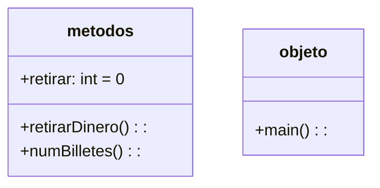

```mermaid
graph TD;
    Inicio-->Introduce_cantidad_retirar;
    Introduce_cantidad_retirar-->A{Es mayor que 5}
    A{Es mayor que 5}--Si-->Usted_quiere_retirar_X
    A{Es mayor que 5?}--No-->Seleccione_cifra_mayor_que_5
    Seleccione_cifra_mayor_que_5-->Introduce_cantidad_retirar
    Usted_quiere_retirar_X-->Recibirá:
    Recibirá:-->B{Hay billetes de 500?}
    B{Hay billetes de 500?}--Si-->NumeroBilletes500=X
    NumeroBilletes500=X-->D{Hay billetes de 200?}
    B{Hay billetes de 500?}--No-->D{Hay billetes de 200?}
    D{Hay billetes de 200?}--Si-->NumeroBilletes200=X
    NumeroBilletes200=X-->F{Hay billetes de 100?}
    D{Hay billetes de 200?}--No-->F{Hay billetes de 100?}
    F{Hay billetes de 100?}--Si-->NumeroBilletes100=X
    F{Hay billetes de 100?}--No-->G{Hay billetes de 50?}
    NumeroBilletes100=X-->G{Hay billetes de 50?}
    G{Hay billetes de 50?}--Si-->NumeroBilletes50=X
    G{Hay billetes de 50?}--No-->H{Hay billetes de 20?}
    NumeroBilletes50=X-->H{Hay billetes de 20?}
    H{Hay billetes de 20?}--Si-->NumeroBilletes20=X
    H{Hay billetes de 20?}--No-->I{Hay billetes de 10?}
    NumeroBilletes20=X-->I{Hay billetes de 10?}
    I{Hay billetes de 10?}--Si-->NumeroBilletes10=X
    I{Hay billetes de 10?}--No-->J{Hay billetes de 5?}
    NumeroBilletes10=X-->J{Hay billetes de 5?}
    J{Hay billetes de 5?}--Si-->NumeroBilletes5=X
    J{Hay billetes de 5?}--No-->K{DeseasContinuarRealizOperaciones?}
    NumeroBilletes5=X-->K{DeseasContinuarRealizandoOperaciones?}
    K{DeseasContinuarRealizandoOperaciones?}--Si-->Introduce_cantidad_retirar
    K{DeseasContinuarRealizandoOperaciones?}--No-->Fin 
   
```