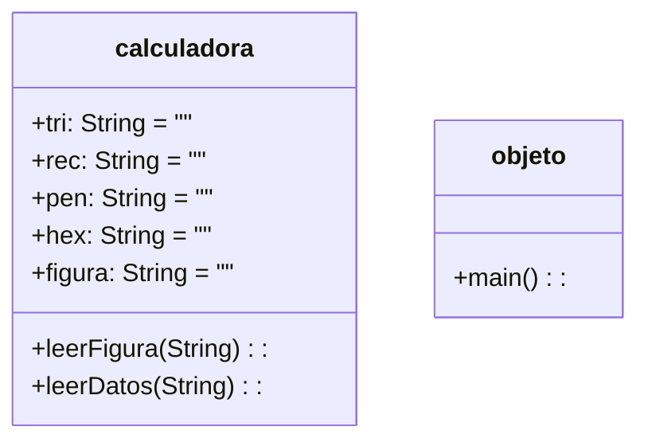

```mermaid
graph TD;
    Inicio-->Introduce_figura;
    Introduce_figura-->B{Es un triangulo?}
    Introduce_figura-->C{Es un hexagono?}
    Introduce_figura-->D{Es un pentagono?}
    Introduce_figura-->G{Es un rectangulo?}
    B-->Introduce_base1_y_altura
    G-->Introduce_base1_y_altura
    C-->Introduce_perimetro_y_apotema
    D-->Introduce_perimetro_y_apotema
    Introduce_base1_y_altura-->Introduce_cifra1_cifra2
    Introduce_perimetro_y_apotema-->Introduce_cifra1_cifra2
    Introduce_cifra1_cifra2-->H{Es un triangulo?}
    H{Es un triangulo?}--yes-->Area=base*altura/2
    H{Es un triangulo?}--no-->I{Es un hexagono?}
    I{Es un hexagono?}--yes-->Area=perim*apotema/2
    I{Es un hexagono?}--no-->J{Es un rectangulo?}
    J{Es un rectangulo?}--yes-->Area=base*altura
    J{Es un rectangulo?}--no-->K{Es un pentagono?}
    K{Es un pentagono?}--yes-->Area=perim*apotema
```